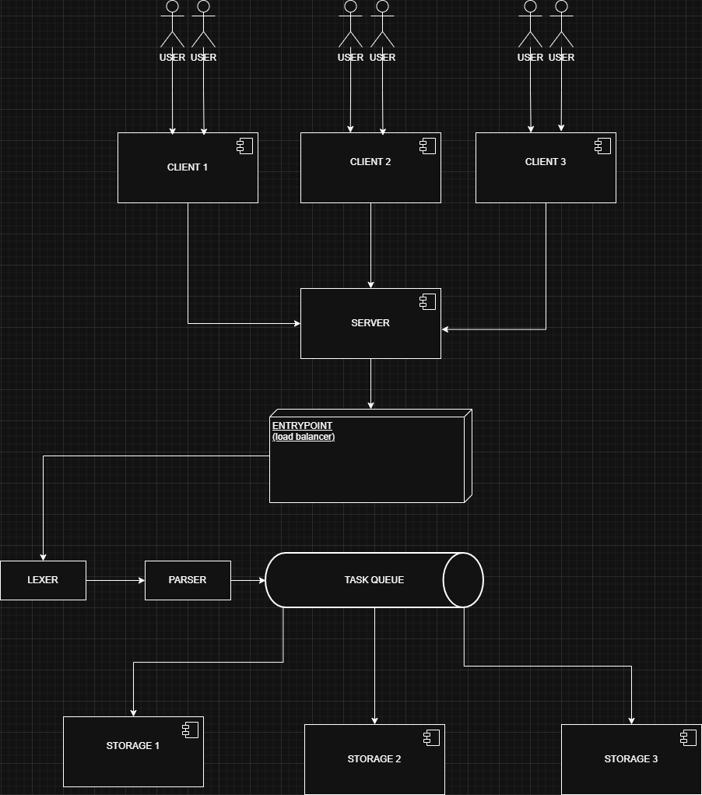

### Задание

Описание задания лежит в `docs/requirements.pdf`

### Балансировщик

Балансировщик распределяет запросы между Storage-узлами. У каждой базы данных есть свой мьютекс.
Поэтому два запроса для двух бд обрабатываются параллельно. Если прилетает два запроса к одной базе данных, то они
обрабатываются последовательно.

### Асинхронность

Создана специальная структура std::unordered_map в entrypoint, которая хранит как ключ uuid задачи, а значение результат.
Пользователю моментально отдается uuid задачи. А также предоставляется апи для получения самого результата. 

### Архитектура приложения



### Сборка

Проект собирается с помощью `cmake` и `vcpkg`.

Убедитесь, что у вас установлены эти инструменты. В случае,
если они не установлены, то воспользуйтесь официальными инструкциями
для установки.

Перед сборкой, нам необходимо узнать, где находится файл vcpkg. 

Если вы используете Windows, то один из способов это в PowerShell
ввести такую команду:
```bash
dir -Path C:\ -Filter vcpkg.cmake -Recurse -ErrorAction SilentlyContinue -Force | Select-Object -ExpandProperty FullName
```

#### Терминал 
Для запуска через терминал, используйте следующие команды
```bash
cmake -B build -S . -DCMAKE_TOOLCHAIN_FILE=/путь/к/vcpkg/scripts/buildsystems/vcpkg.cmake
cmake --build build
```

Для удобства сборки можно использовать IDE.

#### Clion

File | Settings | Build, Execution, Deployment | CMake

В поле `CMake Options` добавить:
```bash
-DCMAKE_TOOLCHAIN_FILE=/путь/к/vcpkg/scripts/buildsystems/vcpkg.cmake
```

### SSL

Для запуска проекта придется также выпустить самоподписанный ssl сертификат для защищенного соединения между клиентом 
и сервером. Это можно сделать с помощью утилиты `openssl`. Пример команды:
```bash
openssl req -x509 -nodes -days 365 -newkey rsa:2048 -keyout certs/server.key -out certs/server.crt
```

Здесь `-nodes`: не шифровать закрытый ключ (чтобы сервер запускался без пароля)


### Запуск проекта
Для того чтобы запустить проект, необходимо стартовать два приложения main_server и main_client.
> main_server нужно запускать перед main_client

Для их запуска необходимо вторым аргументом командой строки передать номер порта, номер порта для клиента и для сервера
должен совпадать

```bash
./main_server.exe 1234
./main_client.exe 1234
```

#### Clion
Для удобства запуска через IDE можно в настройках конфигурации пробросить аргументы командной строки:
В настройках конфигурации для main_server и main_client в поле `Program arguments` добавить номер порта (например 1234)

---

Под капотом main_server запускает entrypoint, который в свою очередь плодит множество процессов (main_storage_node).
При разработке требуется пересобирать не только main_server и main_client, но и main_storage_node, ведь автоматически 
он не будет пересобирать

#### Clion
Для удобства в Clion это можно сделать так:
Зайти в настройки конфигурации для main_client и main_server, в поле `Before launch` выбрать `Cmake target` и уже там
выбрать main_storage_node. Тогда он будет собирать каждый раз новый main_storage_node.


